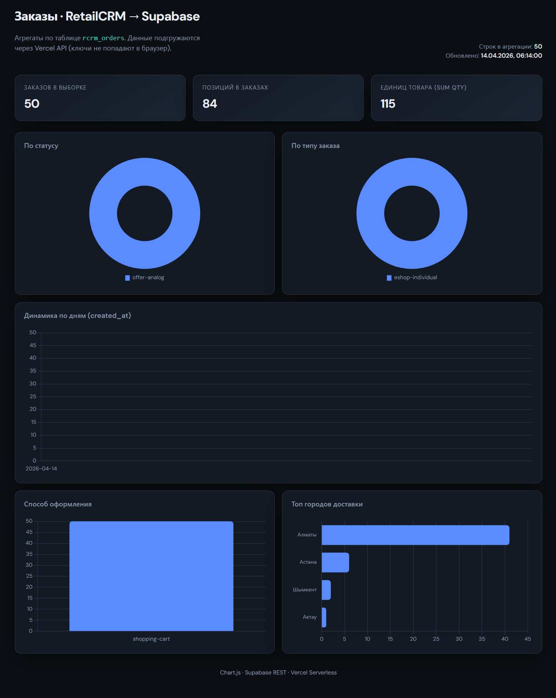
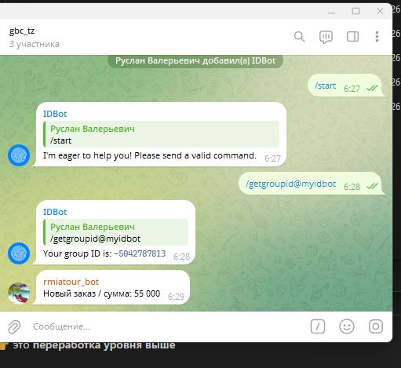

# gbc-tz — RetailCRM, Supabase, Telegram, дашборд

Набор скриптов и мини-приложений для работы с **RetailCRM**, выгрузки в **Supabase**, уведомлений в **Telegram** и статического **дашборда** на Vercel (HTML + Chart.js).

Требования к окружению:

- **PHP 7.4+** с расширением `curl` — для CLI-скриптов и вебхука в корне репозитория.
- **Node.js** — только для деплоя папки `vercel_dashboard` на Vercel (серверless `api/stats.js`).

---

## Структура репозитория

| Путь | Назначение |
|------|------------|
| `import_orders.php` | Импорт заказов из `mock_orders.json` в RetailCRM (`POST /api/v5/orders/create`), защита от дублей по `externalId`, лог в `import_orders.log`. |
| `import_retailcrm_to_supabase.php` | Обратная выгрузка: заказы из RetailCRM (`GET /api/v5/orders`) → таблица Supabase `rcrm_orders`. Режим `--dry-run` без записи. |
| `retailcrm_tg_webhook.php` | Вебхук RetailCRM → сообщение в Telegram с суммой заказа. Поддержка **GET** и **POST** (JSON / form), опциональный секрет. |
| `mock_orders.json` | Тестовые заказы для импорта в CRM. |
| `inst.txt` | Выдержка из спецификации RetailCRM API (пример ответа, метод списка заказов, фильтры). |
| `inst_upload_order.md` | Документация по созданию заказа (`POST /api/v5/orders/create`). |
| `prompts_tz.md` | Внутренний список формулировок ТЗ (история запросов). |
| `import_orders.log` | Лог работы `import_orders.php` (лучше не коммитить). |
| `vercel_dashboard/` | Статический дашборд + serverless API для агрегатов из Supabase. |

> **Безопасность:** в PHP-файлах могут быть заданы URL, ключи API и токены. Перед публикацией в GitHub вынесите секреты в переменные окружения или конфиг вне репозитория и **смените уже засвеченные ключи**.

---

## 1. Импорт заказов в RetailCRM (`import_orders.php`)

1. Заполните константы в начале файла: `RETAILCRM_BASE_URL`, `RETAILCRM_API_KEY`, `RETAILCRM_SITE`, при необходимости коды кастомных полей (`utm_source`, `order_type`).
2. По умолчанию читается `mock_orders.json` из той же папки.
3. Опционально через окружение: `ORDERS_JSON_PATH`, `LOG_PATH`.

```bash
php import_orders.php
```

Лог: `import_orders.log`.

---

## 2. Импорт из RetailCRM в Supabase (`import_retailcrm_to_supabase.php`)

1. Укажите `SUPABASE_URL`, `SUPABASE_SERVICE_ROLE_KEY`, при необходимости `SUPABASE_TABLE` (по умолчанию `rcrm_orders`).
2. Пагинация RetailCRM: `limit` только **20, 50 или 100** (в скрипте используется 100).

Полный импорт:

```bash
php import_retailcrm_to_supabase.php
```

Просмотр полей и примера строки **без записи** в Supabase:

```bash
php import_retailcrm_to_supabase.php --dry-run
```

Маппинг колонок: `first_name`, `last_name`, `phone`, `email`, `order_type`, `order_method`, `status`, `items` (jsonb), `delivery_city`, `delivery_address`, `custom_fields` (jsonb, плюс служебные `_retailcrm_*` при наличии данных в ответе API).

---

## 3. Вебхук RetailCRM → Telegram (`retailcrm_tg_webhook.php`)

Разместите файл на своём сервере с PHP и укажите URL в настройках RetailCRM.

- Методы: **GET** или **POST**.
- Сумма ищется по полям вроде `totalSumm`, `summ`, `amount`, `order[totalSumm]` и др. (см. комментарии в файле).
- Пример GET: `?secret=...&totalSumm=2751` (если включён `WEBHOOK_SECRET`).
- Настройте константы: `TELEGRAM_BOT_TOKEN`, `TELEGRAM_CHAT_ID`, при необходимости `WEBHOOK_SECRET` и заголовок `SECRET_HEADER`.

Ответы — JSON (`Content-Type: application/json`).

---

## 4. Дашборд на Vercel (`vercel_dashboard/`)

Статическая страница `index.html` (Chart.js с CDN) запрашивает агрегированные данные у **serverless-функции** `api/stats.js`, которая читает таблицу `rcrm_orders` через Supabase REST API.

### Переменные окружения на Vercel

| Переменная | Описание |
|------------|----------|
| `SUPABASE_URL` | URL проекта, например `https://xxxx.supabase.co` |
| `SUPABASE_SERVICE_ROLE_KEY` | Ключ с правом `SELECT` по таблице (или anon при настроенном RLS) |

`vercel.json` задаёт проект без фреймворка (`framework: null`).

### Деплой

Из каталога `vercel_dashboard`:

```bash
cd vercel_dashboard
vercel
```

Локально для проверки API и путей:

```bash
vercel dev
```

Фронтенд обращается к **`/api/stats`** (относительный путь — важно для продакшена на том же домене Vercel).

### Опубликованный дашборд

Рабочий экземпляр на Vercel: **[project-2zj8b.vercel.app](https://project-2zj8b.vercel.app/)** — графики и агрегаты по данным из Supabase (тот же стек, что в `vercel_dashboard/`).



### Уведомления в Telegram (вебхук RetailCRM)

Скрипт `retailcrm_tg_webhook.php` отправляет в выбранный чат короткое сообщение при срабатывании хука из RetailCRM (в том числе с суммой заказа). Ниже пример того, как выглядит простое текстовое сообщение в чате.



### Вложенный Git

В `vercel_dashboard/` может лежать отдельная папка `.git`. Для одного общего репозитория на GitHub обычно удаляют вложенный `.git` или оформляют подмодуль — иначе корневой репозиторий не увидит файлы внутри как часть одного проекта.

---

## Схема данных Supabase (ориентир)

Таблица **`rcrm_orders`** создаётся по вашей SQL-схеме; скрипты и API ожидают как минимум поля, перечисленные в разделах 2 и 4 (в т.ч. `items` и `custom_fields` как JSON).

---

## Лицензия

Укажите при необходимости (репозиторий без явной лицензии).
